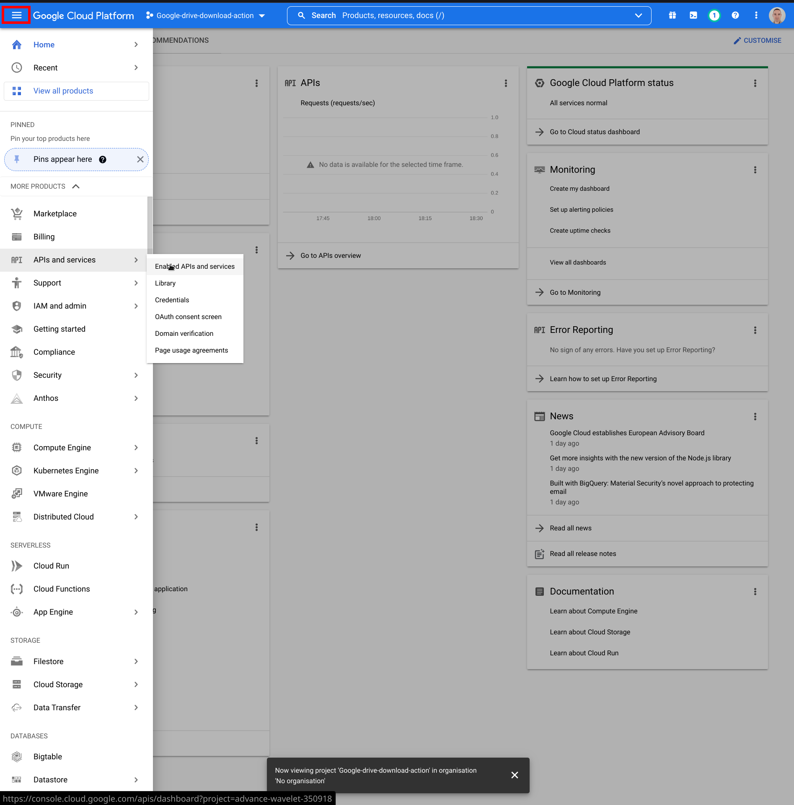
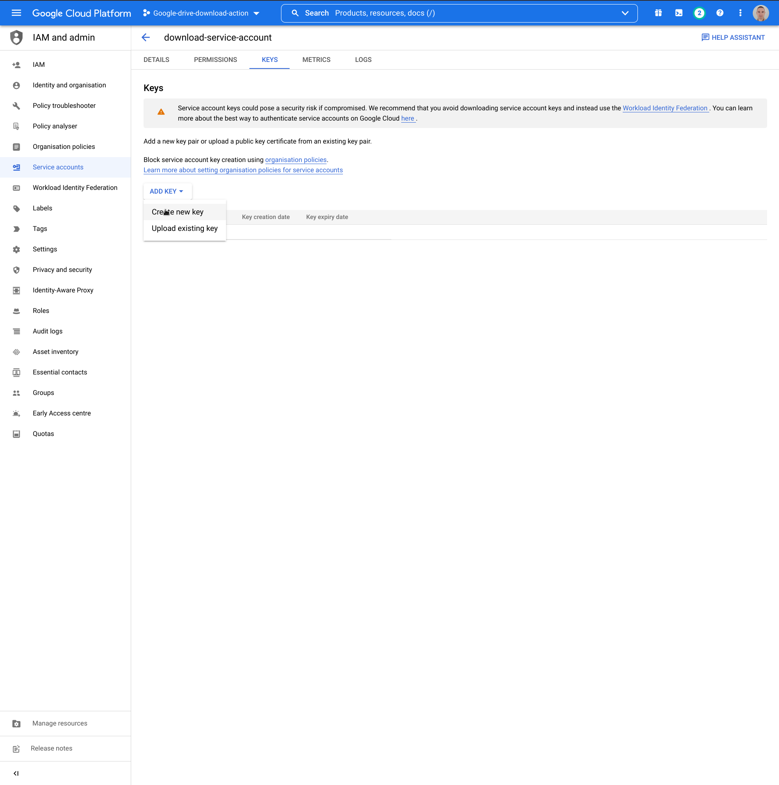
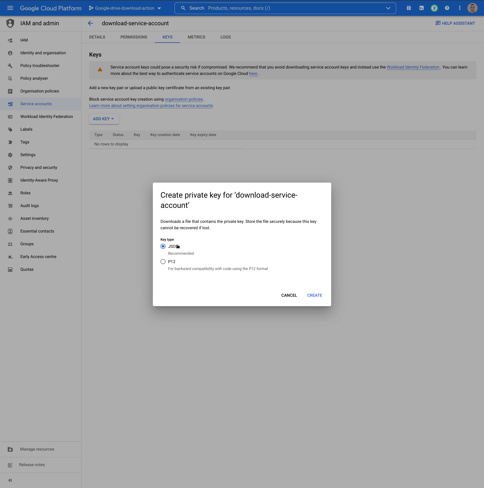
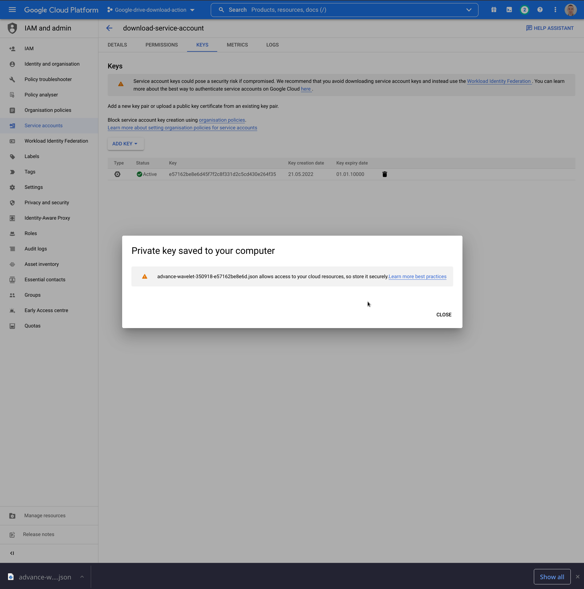

## Create authentication keys for the service account and download it as `json` file

1. Click button marked in red and then
   choose "APIs and services" and "Enabled APIs and services"
   . 
2. Click on the newly created service account
   . 
3. Click tab pointed by mouse "KEYS"
   . 
4. Click "ADD KEY" button and then "Create new key" option
   . 
5. Choose "JSON" key type and click "CREATE"
   . 
6. JSON file with kye will be automatically downloaded to your computer
   . 
7. In the repository when you will use "Simple Download Google Drive file" action you have to create a new secret with
   the content of JSON file that you just created.
    1. On GitHub, navigate to the main page of the repository.
    2. Under your repository name, click on the "Settings" tab.
    3. In the left sidebar, click "Secrets".
    4. On the right bar, click on "Add a new secret"
       
    5. Type `SERVICE_ACCOUNT_KEY_JSON` as a name for your secret in the "Name" input box.
    6. Paste content of JSON file as "Value".
    7. Click "Add secret" to finish this procedure.
       

Authentication key and secret are created now. Follow next instructions. 
