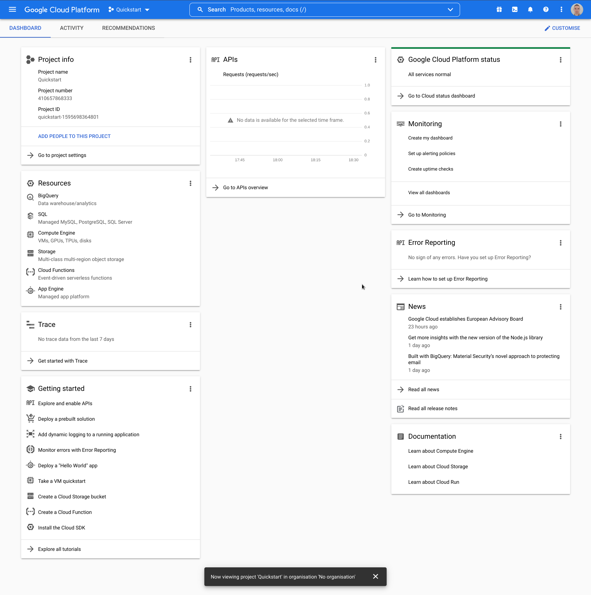
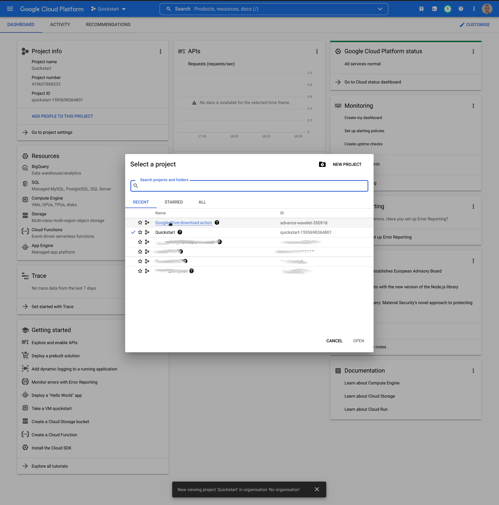

## Create a project in the [Google Cloud Platform Console](https://console.cloud.google.com/)

1. Go to [Google Cloud Platform Console](https://console.cloud.google.com/)
   
   Please click button marked in red.
2. Click "NEW PROJECT" button. 
3. Enter the name for new project. In this example I used "Google-drive-download-action". After that you can click "
   CREATE". 
4. If your new project is not yet selected in the console, you can select it. Just click button marked in red and then
   your new project. 

Project is created now. Follow next instructions. 
