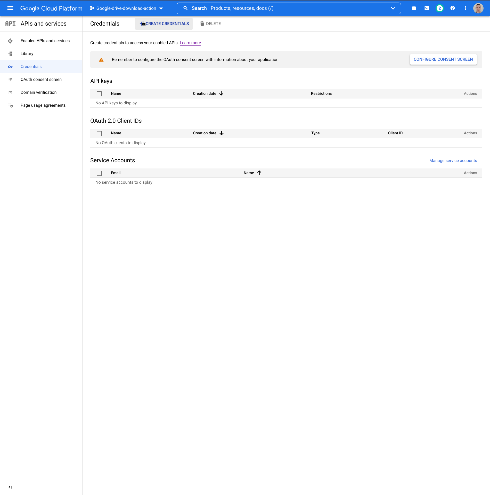
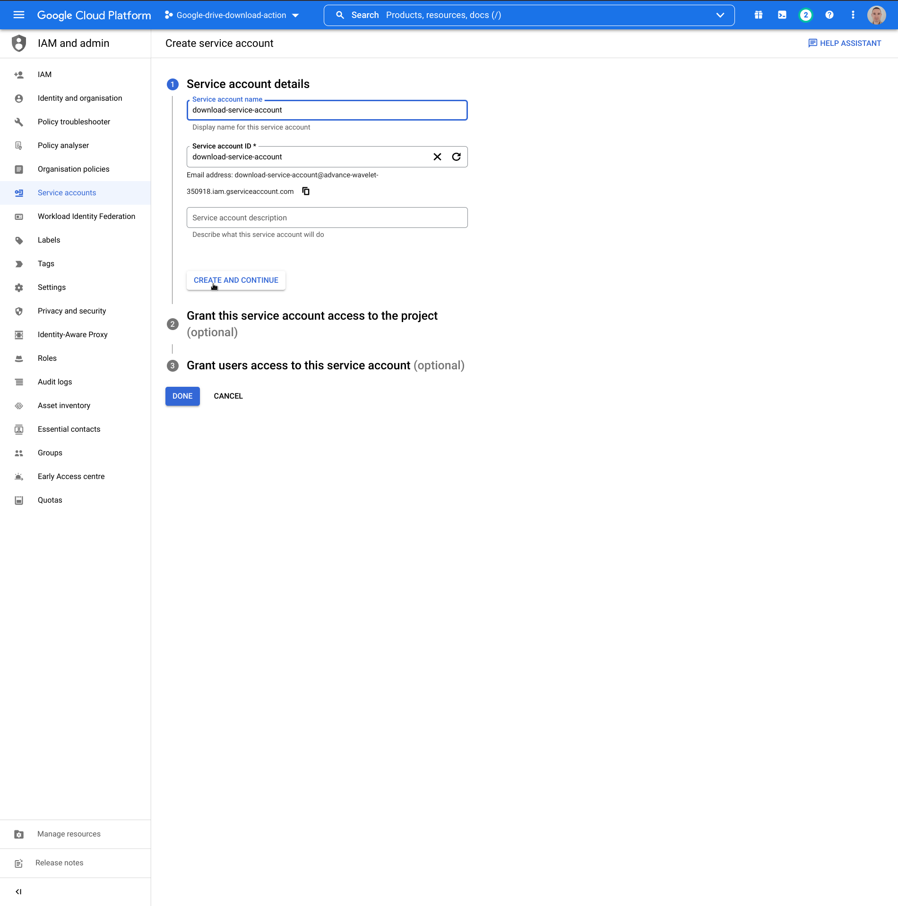

## Create a service account for new project

1. Click button marked in red and then
   choose "APIs and services" and "Enabled APIs and services"
   . 
2. Click button pointed by mouse "Credentials"
   . 
3. Click button pointed by mouse "CREATE CREDENTIALS"
   . 
4. Click option pointed by mouse "Service account"
   . 
5. Enter name for new service account, in my case it's "download-action-service". After that please click button pointed
   by mouse "CREATE AND CONTINUE"
   . 

Service account is created now. Follow next instructions. 
