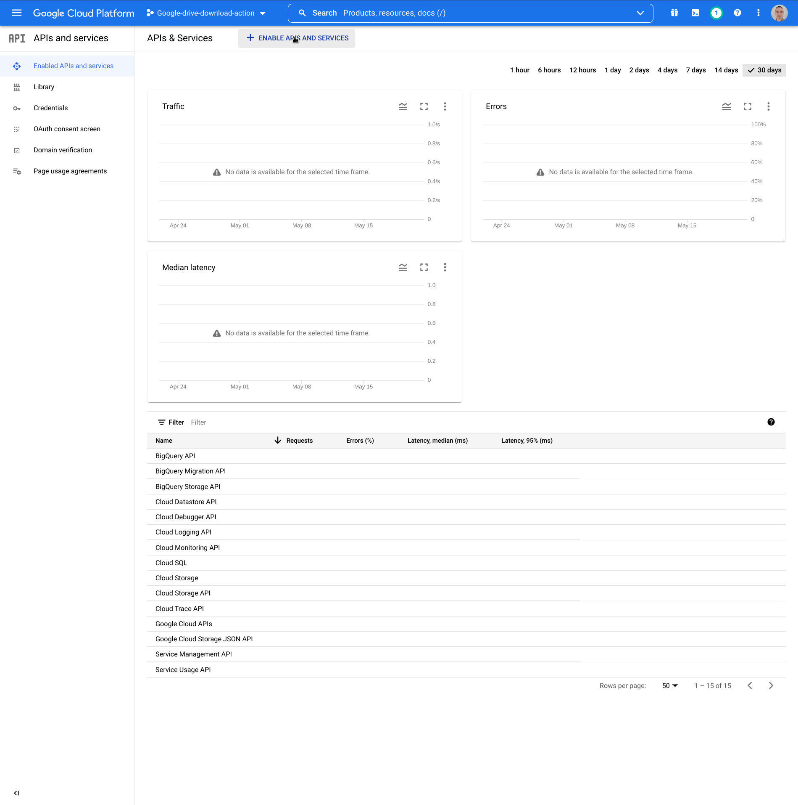
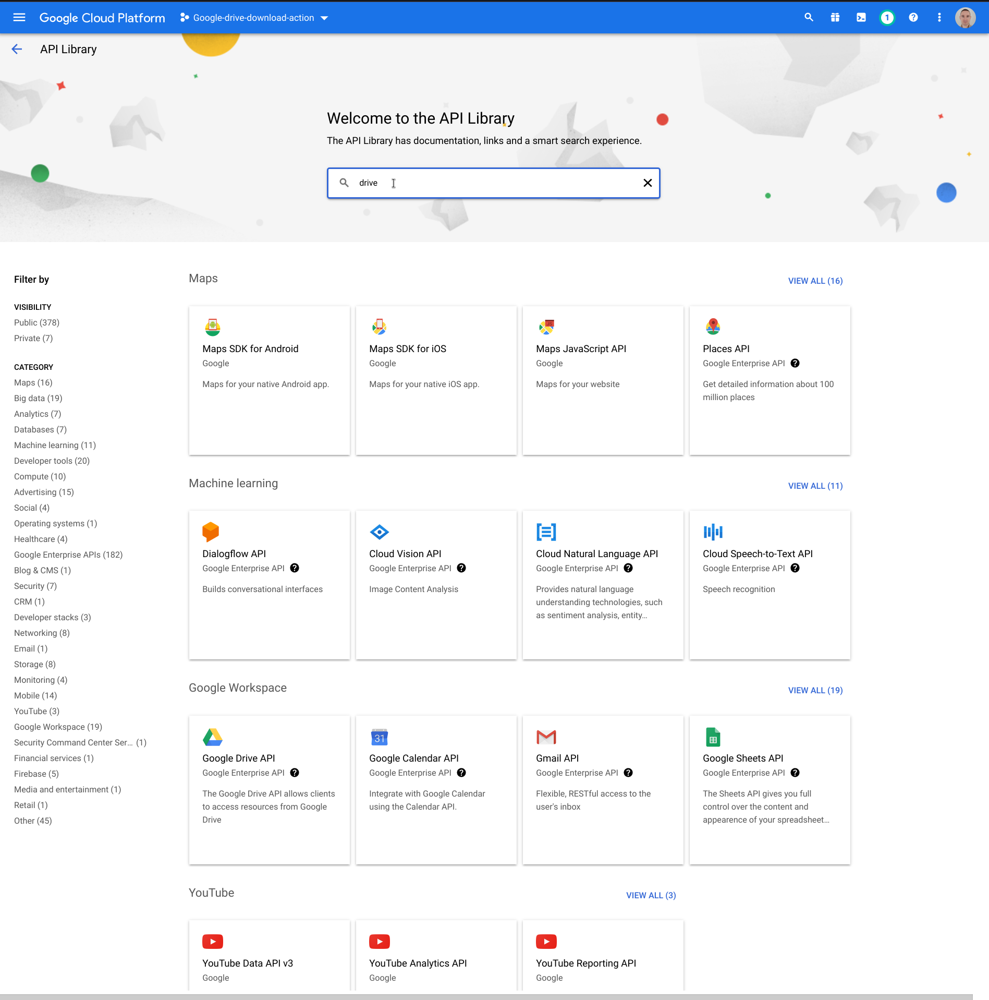
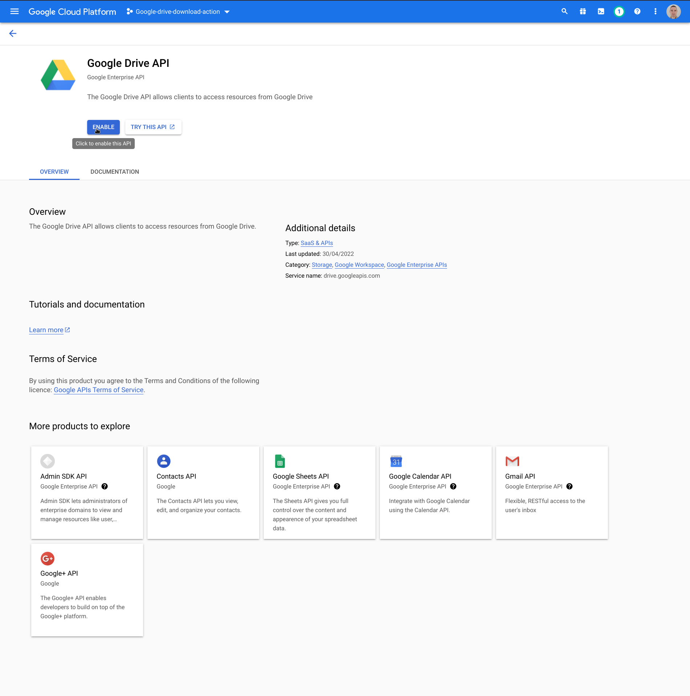

## Enable [Google Drive API](https://developers.google.com/drive/api/v3/enable-drive-api) in new project

1. Click button marked in red and then
   choose "APIs and services" and "Enabled APIs and services"
   . 
2. Click button pointed by mouse "+ENABLE APIS AND SERVICES"
   . 
3. Use search input to search for Google Drive API
   . 
4. Choose "Google Drive API" from the list of found APIs
   . 
5. Click button pointed by mouse "ENABLE" to enable this API in the project.
   . 

You have enabled Google Drive API in the newly created project. Follow next instructions.