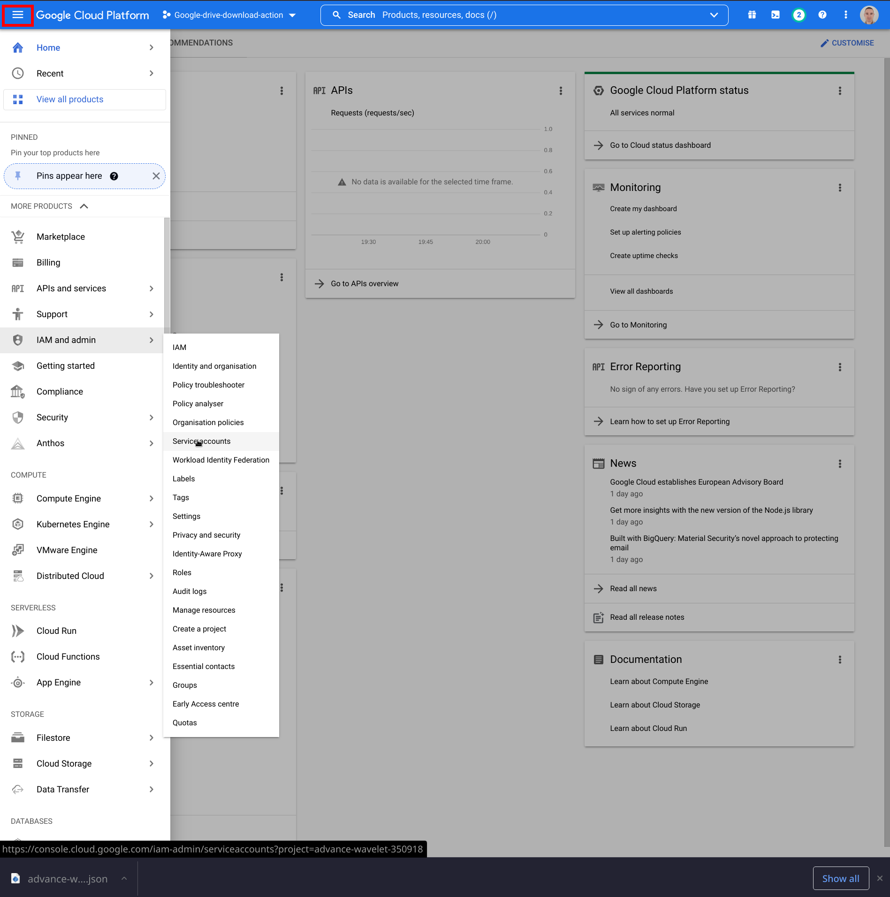
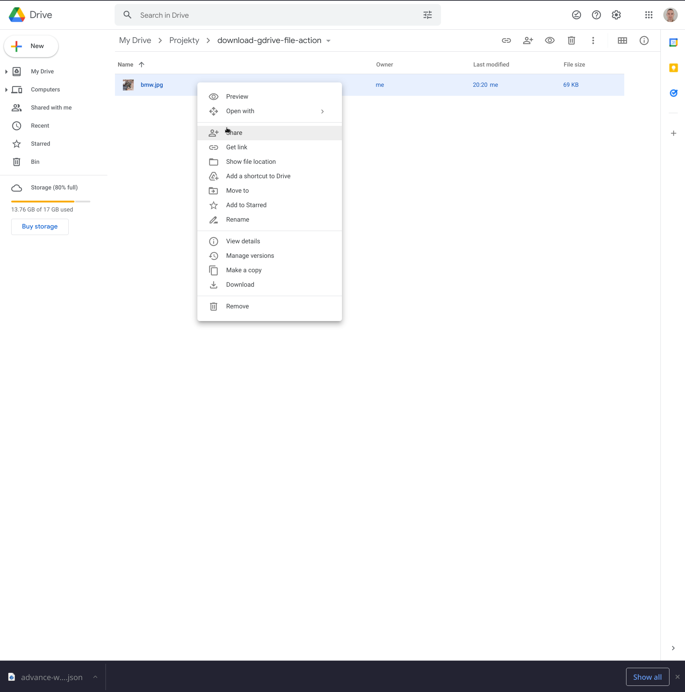

## Share the file that you want to download to the service account

The file that will be downloaded by GitHub workflow must be shared with the service account created in the previous
steps.

1. Click button marked in red and then
   choose "IAM and admin" and "Service account"
   . 
2. Mark and copy the email name of service account.
   . 
3. Go to your Google Drive where you keep file that will be downloaded in GitHub workflow. Click it with the right mouse
   button and click "Share".
   . 
4. In the "Add people and group" input enter email of the service account that you copied in step 2.
   . 
5. Choose "Viewer" role for the service account and click "Send"
   . 

File is shared, and now you can download it using "Simple Download Google Drive file" action. 

